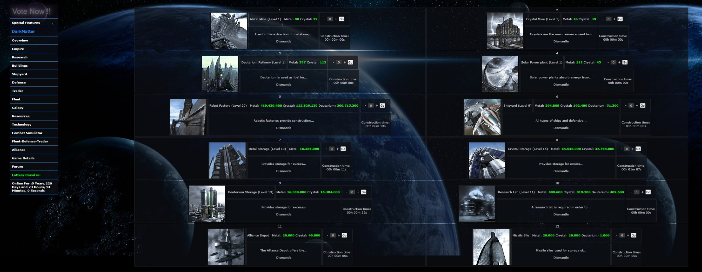
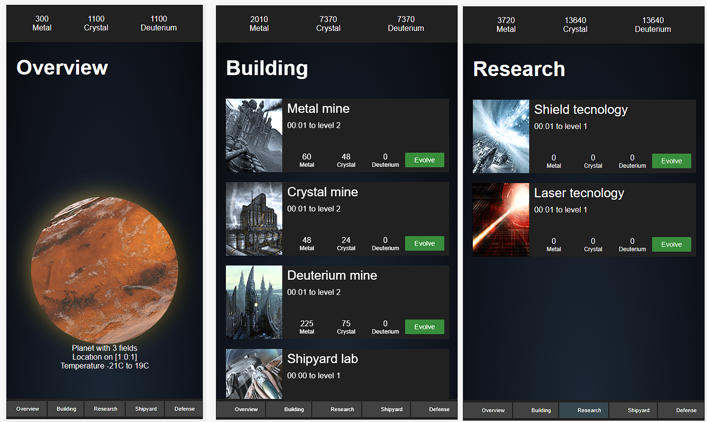

# OGame remake

O OGame era um popular jogo de navegador, tive a oportunidade de jogar bastante durante o auge, utilizei a ideia do jogo para o aprendizado em meu primeiro projeto de F# (F Sharp) usando Fable.

[Link para jogar](https://sylviot.github.io/ogame-remake/dist/index.html)

## Original vs Remake
Essa é uma imagem do OGame no navedaor.

No remake tentei fazer algo mais simples porém funcional em navegadores com responsividade.

## Tecnologias

* [F Sharp - F#](https://fsharp.org/)
* [Fable](https://github.com/fable-compiler/Fable)
* [Feliz](https://github.com/Zaid-Ajaj/Feliz)
* [Elmish a.k.a Elm](https://elmish.github.io/elmish)
